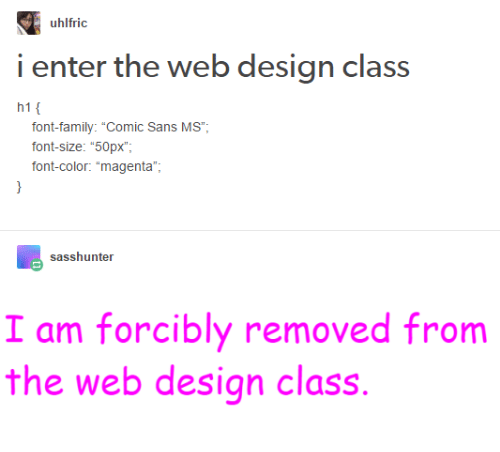

# IMK_Project
### Proyek akhir IMK

git add

git commit

git push

itu aja, kalau bisa bikin branch sekalian, ntar bikin pull request aku tes in

## CSS
1. buat file css nya sendiri di ./resource/
2. masukin import ke ./resource/style.css jadi semua html bisa sama import nya kek index.html
3. format import ke style.css udah aku kasih
4. masukin kode utama halamannya di index.html
5. tiap halaman baru yang dibuka via link kasih href di index.html dan buat file html baru pake nama 'nama-laman.html'
6. index.html khusus buat landing page aja
7. penjelasan lain ada di dalam masing asing file utama.

buat langkah tambahan masukin aja ke readme ini

# Web Design
